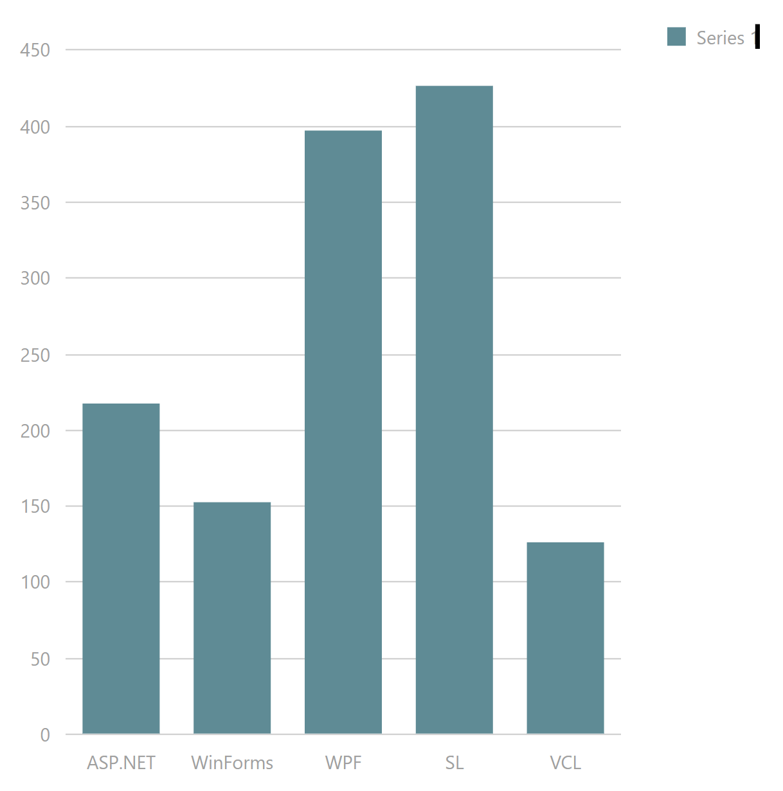

<!-- default badges list -->

<!-- default badges end -->
<!-- default file list -->

# Chart for DevExtreme - How to use the dxChart in an ASP.NET WebForms application

This example is an illustration of the <a href="https://www.devexpress.com/Support/Center/p/KA20011">KA20011: DevExtreme Mobile - Technical FAQ</a> KB Article. Refer to the Article for an explanation.

## Files to Review

- **ASP**
  - [DataHelper.cs](./CS/WebSite/App_Code/DataHelper.cs) (VB: [DataHelper.vb](./VB/WebSite/App_Code/DataHelper.vb))
  - [Default.aspx](./CS/WebSite/Default.aspx) (VB: [Default.aspx](./VB/WebSite/Default.aspx))
  - [Default.aspx.cs](./CS/WebSite/Default.aspx.cs) (VB: [Default.aspx.vb](./VB/WebSite/Default.aspx.vb))

## Documentation

- <a href="http://chartjs.devexpress.com/Blog/pros-and-cons-of-cdn-with-chartjs#.UiR7tz9q1GQ">Pros and cons of CDN usage in projects with ChartJS</a>
- <a href="https://www.devexpress.com/Support/Center/p/E5145">How to bind dxChart to AJAX-enabled WCF service in an ASP.NET application</a>

<!-- feedback -->
## Does this example address your development requirements/objectives?

 

(you will be redirected to DevExpress.com to submit your response)
<!-- feedback end -->
